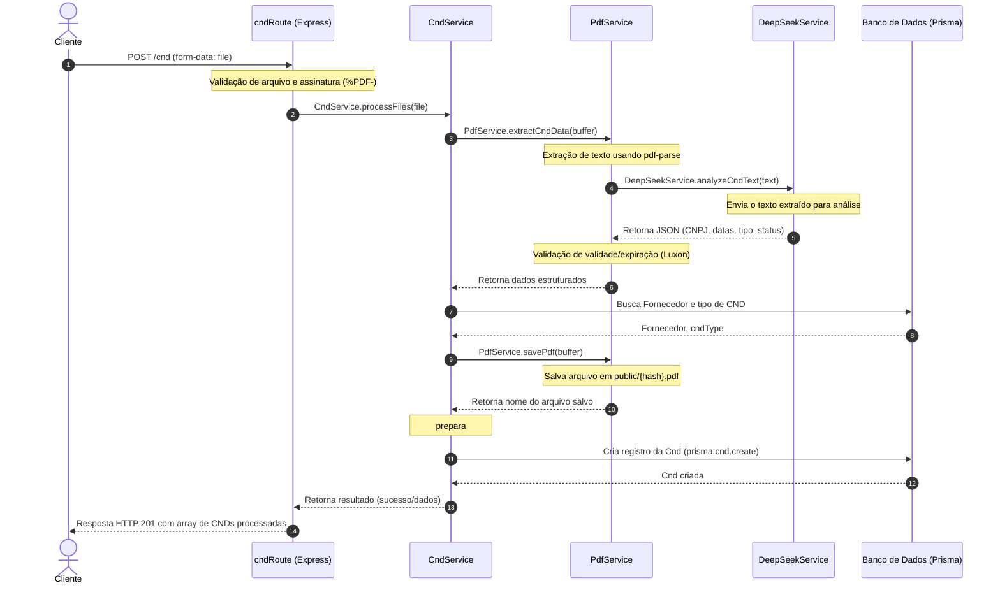

# Dev Docs

### Fluxo de Processamento de CND (Upload)



### Tratamento de Erros

O tratamento de erros foi desenhado para ser centralizado e resiliente, especialmente no processamento em lote de múltiplos arquivos PDF:

1. **Erros Customizados**: Estão mapeados em `src/errors/custom-errors.ts` através de classes que estendem a classe base `BaseError` (como `AppError`, `DeepSeekError` e `PdfError`).
2. **Processamento Individual de CNDs**: No endpoint `POST /cnd`, os erros no processamento de um arquivo individual são capturados isoladamente. Isso garante que se um dos arquivos falhar (por exemplo, arquivo não-PDF, CND vencida, fornecedor inexistente ou erro no DeepSeek), a API não quebre para os outros arquivos. A resposta conterá uma lista com o status de sucesso ou erro formatado para cada arquivo enviado.
3. **Middleware Centralizado (`errorHandler`)**: Localizado em `src/errors/errorHandler.ts`, esse middleware captura erros não tratados, realiza a padronização do log (utilizando a biblioteca `pino`) e formata as respostas HTTP retornadas ao cliente, garantindo consistência na API.

---

### Estrutura de Pastas e Componentes

A estrutura interna do projeto segue uma divisão modular para separar responsabilidades de rotas, validações de dados, regras de negócio e infraestrutura, organizada da seguinte forma:

```text
src/
├── core/                     # Configurações globais e clientes compartilhados 
│   ├── database.ts
│   ├── deepseek-prompt.json
│   ├── deepseek.ts
│   └── logger.ts
├── errors/                   # Erros customizados e tratamento global de exceções
│   ├── custom-errors.ts
│   └── errorHandler.ts
├── generated/                # Cliente e tipos gerados automaticamente pelo Prisma
│   └── prisma/
├── routes/                   # Definição dos endpoints HTTP
│   ├── cnd.ts
│   └── fornecedor.ts
├── schemas/                  # Schemas Zod para validação de entrada e respostas
│   ├── cnd.ts
│   ├── deepseek.ts           # Schema de validação do prompt do DeepSeek
│   └── fornecedor.ts
├── services/
│   ├── cnd.ts                # Regras de negócio relacionadas às CNDs
│   ├── fornecedor.ts         # Regras de negócio relacionadas aos fornecedores
│   ├── pdf.ts                # Manipulação, validação e armazenamento de PDFs
│   └── deepseek.ts           # Integração e tratamento de erros do DeepSeek
├── utils/                    # Funções utilitárias reutilizáveis
│   └── normalize.ts          # Padronização e limpeza de dados de entrada
├── index.ts                  # Ponto de entrada da aplicação
└── server.ts                 # Configuração e inicialização do servidor HTTP
```
