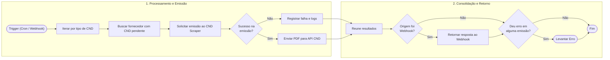

# Integração

---

Este documento irá detalhar como integrar o projeto atual com o projeto [cnd-scraper](https://github.com/pedrobellezia/cnd-scraper) utilizando n8n

---

## 1. Visão Geral da Arquitetura

A integração é composta por três camadas principais que trabalham de forma coordenada:

1. **cnd-api**: Backend central da aplicação responsável pelo gerenciamento de fornecedores, e CNDs.
2. **cnd-scraper**: Microserviço responsável pela emissão das CNDs.
3. **n8n**: Responsável pela automação da emissão e cadastro das CNDs.


---

### 2. Triggers

O workflow do n8n pode ser iniciado de duas maneiras:
1. **Webhook CND**: Chamada HTTP recebida para processar um CNPJ específico.
2. **Agendador (Cron)**: Execução única diária, às 04:05 (expressão cron: `0 5 4 * * *`). Como cada query de fornecedor (passo A) já retorna todos os elegíveis de uma vez (sem `LIMIT`), uma única execução processa a fila inteira em lote, em vez de depender de disparos recorrentes a cada 30 minutos.

---

#### A. Consulta e Fila de Prioridade (SQL queries no n8n)

O workflow possui um nó do tipo **Postgres** para cada tipo de certidão (`fgts`, `trabalhista`, `estadual`, `municipal`). Cada nó devolve **todos os fornecedores elegíveis** daquele tipo (sem `LIMIT`), já com o tipo marcado na própria linha (`'fgts' AS "cndtype"`):

```sql
SELECT
    f.*,
    'fgts' AS "cndtype"
FROM "fornecedor" f
WHERE 
  (
    $1 IS NOT NULL AND f.cnpj = $1
  )
  OR (
    $1 IS NULL 
    AND NOT EXISTS (
      SELECT 1 FROM "cnd" c JOIN "cndtype" ct ON c."cndtypeid" = ct.id
      WHERE c."fornecedorid" = f.id AND ct.name = 'fgts' AND c.status = 'regular'
        AND c."validade" >= NOW() + INTERVAL $2 
    )
    AND NOT EXISTS (
      SELECT 1 FROM "cnd" c JOIN "cndtype" ct ON c."cndtypeid" = ct.id
      WHERE c."fornecedorid" = f.id AND ct.name = 'fgts' AND c.status IN ('error', 'irregular')
        AND c."createdAt" >= NOW() - INTERVAL $3
    )
  );
```

Os quatro resultados (um por tipo de CND) são combinados por um nó **Merge** (`numberInputs: 4`) antes de seguir pro passo B.

##### Regras de Elegibilidade
A query SQL avalia dois cenários principais (utilizando uma cláusula `OR` na condição principal):

1. **Caso 1: Webhook**
   - Ocorre quando um CNPJ é informado no payload da requisição.
   - O fornecedor com o CNPJ correspondente será selecionado diretamente.

2. **Caso 2: Cron**
   - Ocorre quando o CNPJ não é informado (`$1 IS NULL`).
   - O fornecedor só será selecionado se atender simultaneamente a dois requisitos:
     - **Ausência de Certidão Regular Válida**: Não possui nenhuma certidão ativa com status `regular` cuja validade expire após o intervalo limite definido pelo parâmetro `$2` (ex: `5 dias`).
     - **Fora do Período de Cooldown (Intervalo de Retentativa)**: Não possui registros de falha ou de irregularidade (status `error` ou `irregular`) criados dentro do período de carência especificado pelo parâmetro `$3` (ex: `2 dias`), evitando novas tentativas imediatas após falhas recentes.

##### Parâmetros por Tipo de CND

| Tipo de CND | Parâmetro `$2` (Validade Mínima) | Parâmetro `$3` (Intervalo de Cooldown) | Filtros de Suporte |
| :--- | :--- | :--- | :--- |
| **FGTS** | `1 day` (1 dia) | `1 day` (1 dia) | Nenhum. |
| **Trabalhista** | `3 day` (3 dias) | `1 day` (1 dia) | Nenhum. |
| **Estadual** | `3 day` (3 dias) | `2 day` (2 dias) | Apenas UFs com scripts disponíveis cadastrados na tabela `estadual`. |
| **Municipal** | `3 day` (3 dias) | `2 day` (2 dias) | Apenas Municípios/UFs cadastrados na tabela `municipal`. |

---

#### B. Execução do Scraping (Chamada HTTP única e dinâmica)

Diferente da versão anterior (um node HTTP por tipo de CND), agora um único node **"Baixar CND"** processa a fila combinada do passo A, item a item. A URL é montada dinamicamente a partir do `cndtype` de cada item (`http://${SCRAPER_HOST}:${PORT}/{{ $json.cndtype }}`), com autenticação por token (`Authorization: Bearer <SCRAPER_TOKEN>`). O payload é sempre o mesmo formato, com `cnpj`, `uf` e `municipio` (o scraper ignora os campos que não usa para o tipo em questão):
```json
{ "cnpj": "...", "uf": "...", "municipio": "..." }
```

Esse node processa os itens em lote com um intervalo de 2 minutos entre lotes (`batching.batchInterval: 120000`), evitando disparar todas as emissões pendentes de uma vez.

---

#### C. Tratamento de Erros e Mecanismo de Cooldown

O nó **"Verificar Erro"** (nó do tipo Switch no n8n) avalia o resultado retornado pelo `cnd-scraper` para determinar a próxima ação no fluxo:

##### 1. Caso de Sucesso (`success === true`)
O scraper emite a certidão com sucesso e devolve o binário (PDF). O n8n envia os dados via multipart form-data para a CND API no endpoint `POST /cnd` (`http://${CND_HOST}:3030/cnd`), incluindo o header `Authorization: Bearer <API_KEY>` (`API_KEY`, exigido desde que a `cnd-api` passou a autenticar todas as rotas exceto `/public`), para salvar o registro regular no banco.

##### 2. Erros Conhecidos (Fila de Cooldown)
Se a requisição retornar falha e o erro estiver incluso na seguinte lista:
```regex
ElementNotFound, TimeoutError, DownloadError, ScrapError, CaptchaError, CndUnavailable
```
O n8n direciona o fluxo para o seguinte nó Buscar Erro Existente.

##### 3. Erros Genéricos ou Instabilidades Temporárias
Se a falha retornada não estiver na lista de erros conhecidos (como instabilidades temporárias de rede, quedas de serviço ou indisponibilidades gerais), ela não é classificada como passível de cooldown. Dessa forma, nenhuma regra de cooldown é ativada para o fornecedor, permitindo que ele seja selecionado novamente na próxima execução automática do Cron para uma nova tentativa.

##### 4. Fluxo de Registro de Erro (Nó "Buscar Erro Existente")
Quando o erro identificado pertencer aos casos previstos para cooldown (erros conhecidos), o n8n executa a query abaixo para gerenciar o estado da certidão no banco de dados:

```sql
WITH updated AS (
    UPDATE cnd c
    SET
        "createdAt" = NOW()
    FROM fornecedor f
    JOIN cndtype ct
      ON ct.name = $1
    WHERE f.cnpj = $2
      AND c.fornecedorid = f.id
      AND c.cndtypeid = ct.id
      AND c.status = 'error'
    RETURNING c.* 
)
INSERT INTO cnd (
    "id",
    "fornecedorid",
    "cndtypeid",
    "status"
)
SELECT
    gen_random_uuid(),
    f.id,
    ct.id,
    'error'
FROM fornecedor f
JOIN cndtype ct
  ON ct.name = $1
WHERE f.cnpj = $2
  AND NOT EXISTS (
      SELECT 1 FROM updated
  );
```

**Lógica do Upsert:**
Dado um fornecedor e um tipo de certidão (`cndtype`) específicos, a query realiza um *upsert* para controlar o histórico de erros:
- **Atualização (`UPDATE`)**: Se já existir uma certidão com o status `error` para aquele tipo e fornecedor, a query atualiza apenas a coluna `createdAt` com o timestamp atual (`NOW()`), renovando o prazo de cooldown.
- **Inserção (`INSERT`)**: Se não houver nenhum registro de erro ativo, um novo registro com status `error` é inserido.

Essa estratégia evita a criação redundante de múltiplos registros de erro para a mesma certidão e fornecedor, mantendo o banco de dados limpo e otimizando o controle do período de carência.

